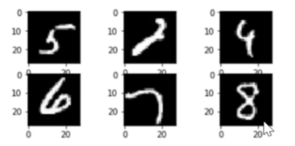
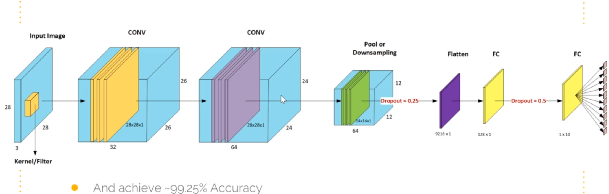

## Problem Definition

- The CNN will use an [MNIST dataset](./data/) is a subset of a larger dataset available from NIST and was copied from [Yann.lecun.com](http://yann.lecun.com/exdb/mnist/)

### Aim of the classifier
- The aim of the classifier is to take digits in the format provided and correctly identify the digit that was written

